# Semantic Code MCP

[](https://www.npmjs.com/package/semantic-code-mcp)
[](https://www.npmjs.com/package/semantic-code-mcp)
[](https://opensource.org/licenses/MIT)
[](https://nodejs.org/)

AI-powered semantic code search for coding agents. An MCP server with **non-blocking background indexing**, **multi-provider embeddings** (Gemini, Vertex AI, OpenAI, local), and **Milvus / Zilliz Cloud** vector storage — designed for **multi-agent concurrent access**.

Run Claude Code, Codex, Copilot, and Antigravity against the same code index simultaneously. Indexing runs in the background; search works immediately while indexing continues.

> Ask *"where do we handle authentication?"* and find code that uses `login`, `session`, `verifyCredentials` — even when no file contains the word "authentication."


## Quick Start

```bash
npx -y semantic-code-mcp@latest --workspace /path/to/your/project
```

Add to your MCP host config:

```json
{
  "mcpServers": {
    "semantic-code-mcp": {
      "command": "npx",
      "args": ["-y", "semantic-code-mcp@latest", "--workspace", "/path/to/project"]
    }
  }
}
```

<details>
<summary>All IDE configs (Claude Code, VS Code, Cursor, Windsurf, Codex, Antigravity)</summary>

**Claude Code** (`~/.claude/settings.local.json`):
```json
{ "mcpServers": { "semantic-code-mcp": { "command": "npx", "args": ["-y", "semantic-code-mcp@latest", "--workspace", "/path/to/project"] } } }
```

**VS Code / Cursor** (`.vscode/mcp.json`):
```json
{ "servers": { "semantic-code-mcp": { "command": "npx", "args": ["-y", "semantic-code-mcp@latest", "--workspace", "${workspaceFolder}"] } } }
```

**Codex** (`~/.codex/config.toml`):
```toml
[mcp_servers.semantic-code-mcp]
command = "npx"
args = ["-y", "semantic-code-mcp@latest", "--workspace", "/path/to/project"]
```

**Antigravity** (`~/.gemini/antigravity/mcp_config.json`):
```json
{ "mcpServers": { "semantic-code-mcp": { "command": "npx", "args": ["-y", "semantic-code-mcp@latest", "--workspace", "/path/to/project"] } } }
```

> VS Code and Cursor support `${workspaceFolder}`. Windsurf requires absolute paths.

</details>

## Features

- **Semantic code search** — concept matching across your codebase, typo-tolerant
- **Hybrid scoring** — semantic similarity (×0.7) + exact match boost (+1.5), balanced ranking
- **Multi-provider embeddings** — Gemini, Vertex AI, OpenAI, OpenAI-compatible, local (nomic-embed)
- **Non-blocking indexing** — `b_index_codebase` returns instantly; poll `f_get_status` for progress
- **Progressive search** — search works during indexing with partial results
- **Smart incremental indexing** — 2-phase mtime→hash check skips unchanged files
- **AST-based chunking** — Tree-sitter parsing for precise function/class boundaries (optional)
- **Reconciliation sweep** — after each index run, queries all Milvus paths and deletes orphan vectors whose source files no longer exist on disk (catches ghosts missed by hash-based pruning)
- **Search dedup** — per-file result limiting ensures diverse output
- **Resource throttling** — CPU capped at 50% during indexing
- **Multi-agent concurrent access** — multiple agents share one Milvus index without conflicts
- **Runtime workspace switching** — `e_set_workspace` changes project without restart
- **Package version lookups** — `d_check_last_version` checks 20+ registries (npm, PyPI, Maven, etc.)

## Tools

| Tool                   | Description                                                  |
| ---------------------- | ------------------------------------------------------------ |
| `a_semantic_search`    | Find code by meaning. Hybrid semantic + exact match scoring. |
| `b_index_codebase`     | Trigger manual reindex (normally automatic & incremental).   |
| `c_clear_cache`        | Reset embeddings cache entirely.                             |
| `d_check_last_version` | Look up latest package version from 20+ registries.          |
| `e_set_workspace`      | Switch project at runtime without restart.                   |
| `f_get_status`         | Server health: version, index progress, config.              |

## How It Works


### Reconciliation Sweep

Hash-based pruning catches deletions during normal indexing, but can miss **ghost vectors** when the hash cache is cleared, files are moved outside the workspace, or a previous job was interrupted.

The **reconciliation sweep** runs automatically after each `b_index_codebase`:

```mermaid
flowchart LR
    A["🔍 Query Milvus\n(all file paths)"] --> B{"File exists\non disk?"}
    B -->|Yes| C["✅ Keep"]
    B -->|No| D["🗑️ Delete vectors\nfilter: file == '...'"]
    D --> E["📊 Report via\nf_get_status"]

    style A fill:#2a4365,color:#bee3f8
    style C fill:#22543d,color:#c6f6d5
    style D fill:#742a2a,color:#fed7d7
    style E fill:#744210,color:#fefcbf
```



```json
{ "index": { "status": "ready", "lastReconcile": { "orphans": 0, "seconds": 0.43 } } }
```

> Independent of `file-hashes.json` — directly compares Milvus ↔ disk as a safety net.

## Configuration

All settings via environment variables. Prefix: `SMART_CODING_`.

### Core

| Variable                        | Default | Description                                |
| ------------------------------- | ------- | ------------------------------------------ |
| `SMART_CODING_VERBOSE`          | `false` | Detailed logging                           |
| `SMART_CODING_MAX_RESULTS`      | `5`     | Search results returned                    |
| `SMART_CODING_CHUNK_SIZE`       | `25`    | Lines per chunk                            |
| `SMART_CODING_CHUNKING_MODE`    | `smart` | `smart` / `ast` / `line`                   |
| `SMART_CODING_MAX_CPU_PERCENT`  | `50`    | CPU cap during indexing                    |
| `SMART_CODING_AUTO_INDEX_DELAY` | `false` | Background index on startup (single-agent) |

### Embeddings

| Variable                          | Default | Description                                                    |
| --------------------------------- | ------- | -------------------------------------------------------------- |
| `SMART_CODING_EMBEDDING_PROVIDER` | `local` | `local` / `gemini` / `openai` / `openai-compatible` / `vertex` |
| `SMART_CODING_GEMINI_API_KEY`     | —       | Gemini API key                                                 |
| `SMART_CODING_GEMINI_DIMENSIONS`  | `768`   | Output dimensions                                              |
| `SMART_CODING_EMBEDDING_API_KEY`  | —       | OpenAI / compatible API key                                    |
| `SMART_CODING_VERTEX_PROJECT`     | —       | GCP project ID                                                 |

### Vector Store

| Variable                             | Default  | Description                            |
| ------------------------------------ | -------- | -------------------------------------- |
| `SMART_CODING_VECTOR_STORE_PROVIDER` | `sqlite` | `sqlite` / `milvus`                    |
| `SMART_CODING_MILVUS_ADDRESS`        | —        | Milvus endpoint or Zilliz Cloud URI    |
| `SMART_CODING_MILVUS_TOKEN`          | —        | Auth token (required for Zilliz Cloud) |

### Search Tuning

| Variable                          | Default | Description                                  |
| --------------------------------- | ------- | -------------------------------------------- |
| `SMART_CODING_SEMANTIC_WEIGHT`    | `0.7`   | Semantic score weight                        |
| `SMART_CODING_EXACT_MATCH_BOOST`  | `1.5`   | Boost for exact query match in chunk content |
| `SMART_CODING_DEDUP_MAX_PER_FILE` | `1`     | Max results per file (`0` = disabled)        |

### Example: Gemini + Milvus

```json
{
  "mcpServers": {
    "semantic-code-mcp": {
      "command": "npx",
      "args": ["-y", "semantic-code-mcp@latest", "--workspace", "/path/to/project"],
      "env": {
        "SMART_CODING_EMBEDDING_PROVIDER": "gemini",
        "SMART_CODING_GEMINI_API_KEY": "YOUR_KEY",
        "SMART_CODING_VECTOR_STORE_PROVIDER": "milvus",
        "SMART_CODING_MILVUS_ADDRESS": "http://localhost:19530"
      }
    }
  }
}
```

## Milvus Setup (Docker)

<details>
<summary>Docker Compose for Milvus Standalone</summary>

Milvus Standalone runs 3 containers (standalone + etcd + minio). Minimum 4 GB RAM.

```bash
# Download official compose file
wget https://github.com/milvus-io/milvus/releases/download/v2.5.1/milvus-standalone-docker-compose.yml -O docker-compose.yml

# Start
docker compose up -d

# Verify
curl http://localhost:19530/v1/vector/collections
```

> **SQLite vs Milvus:** SQLite is single-process. Milvus handles concurrent reads/writes from multiple agents. Use Milvus when running 2+ agents on the same codebase.

</details>

## Documentation

Detailed technical documentation is available in the [`docs/`](docs/) directory:

- [IDE Setup Guides](docs/ide-setup/) — VS Code, Cursor, Windsurf, Claude Desktop, Antigravity
- [Milvus / Zilliz Cloud Setup](docs/milvus-setup.md)
- [Architecture & Internals](docs/architecture.md)

## License

MIT License — see [LICENSE](LICENSE) for full text.

Copyright (c) 2025 Omar Haris (original), bitkyc08 (modifications, 2026)

This project is a fork of [smart-coding-mcp](https://github.com/omarHaris/smart-coding-mcp) by Omar Haris.

**Key additions over upstream**:
- Multi-provider embeddings (Gemini, Vertex AI, OpenAI, OpenAI-compatible)
- Milvus vector store with ANN search
- Hybrid search scoring (semantic + lexical)
- Per-file dedup, AST chunking, resource throttling
- Reconciliation sweep (Milvus↔disk ghost vector cleanup)
- Runtime workspace switching, package version checker
