# Semantic Code MCP

[](https://www.npmjs.com/package/semantic-code-mcp)
[](https://www.npmjs.com/package/semantic-code-mcp)
[](https://opensource.org/licenses/MIT)
[](https://nodejs.org/)
[]()
[]()
[](https://milvus.io)

AI-powered semantic code search for coding agents. An MCP server with **non-blocking background indexing**, **multi-provider embeddings** (Gemini, Vertex AI, OpenAI, local), and **Milvus / Zilliz Cloud** vector storage — designed for **multi-agent concurrent access**.

Run Claude Code, Codex, Copilot, and Antigravity against the same code index simultaneously. Indexing runs in the background; search works immediately while indexing continues.

> Ask *"where do we handle authentication?"* and find code that uses `login`, `session`, `verifyCredentials` — even when no file contains the word "authentication."

## Quick Start

```bash
npx -y semantic-code-mcp@latest --workspace /path/to/your/project
```

MCP config:

```json
{
  "mcpServers": {
    "semantic-code-mcp": {
      "command": "npx",
      "args": ["-y", "semantic-code-mcp@latest", "--workspace", "/path/to/project"]
    }
  }
}
```


## Why

Traditional `grep` and keyword search break down when you don't know the exact terms used in the codebase. Semantic search bridges that gap:

- **Concept matching** — `"error handling"` finds `try/catch`, `onRejected`, `fallback` patterns
- **Typo-tolerant** — `"embeding modle"` still finds embedding model code
- **Hybrid scoring** — semantic similarity (0.7 weight) + lexical exact/partial match boost (up to +1.5)
- **Search dedup** — per-file result limiting (default 2) prevents a single large file from dominating results
- **Context-aware chunking** — AST-based (Tree-sitter) or smart regex splitting preserves code structure
- **Fast** — progressive indexing lets you search while the codebase is still being indexed

Based on [Cursor's research](https://cursor.com/blog/semsearch) showing semantic search improves AI agent performance by 12.5%.

## Setup

<details>
<summary><strong>Claude Code / Claude Desktop</strong></summary>

```json
{
  "mcpServers": {
    "semantic-code-mcp": {
      "command": "npx",
      "args": ["-y", "semantic-code-mcp@latest", "--workspace", "/path/to/project"]
    }
  }
}
```

Claude Code: `~/.claude/settings.local.json` → `mcpServers`  
Claude Desktop: `~/Library/Application Support/Claude/claude_desktop_config.json`

</details>

<details>
<summary><strong>VS Code / Cursor / Windsurf (Copilot)</strong></summary>

Create `.vscode/mcp.json` in your project root:

```json
{
  "servers": {
    "semantic-code-mcp": {
      "command": "npx",
      "args": ["-y", "semantic-code-mcp@latest", "--workspace", "${workspaceFolder}"]
    }
  }
}
```

> VS Code and Cursor support `${workspaceFolder}`. Windsurf requires absolute paths.

</details>

<details>
<summary><strong>Codex (OpenAI)</strong></summary>

`~/.codex/config.toml`:

```toml
[mcp_servers.semantic-code-mcp]
command = "npx"
args = ["-y", "semantic-code-mcp@latest", "--workspace", "/path/to/project"]
```

</details>

<details>
<summary><strong>Antigravity (Google)</strong></summary>

`~/.gemini/antigravity/mcp_config.json`:

```json
{
  "mcpServers": {
    "semantic-code-mcp": {
      "command": "npx",
      "args": ["-y", "semantic-code-mcp@latest", "--workspace", "/path/to/project"]
    }
  }
}
```

</details>

<details>
<summary><strong>🐚 Shell Script (Monorepo / Large Codebases)</strong></summary>

For monorepos or workspaces with 1000+ files, a shell wrapper script gives you:
- **Real-time logs** — see indexing progress, error details, 429 retry status
- **No MCP timeout** — long-running index operations won't be killed
- **Environment isolation** — pin provider credentials per project

Create `start-semantic-code-mcp.sh`:

```bash
#!/bin/bash
export SMART_CODING_WORKSPACE="/path/to/monorepo"
export SMART_CODING_EMBEDDING_PROVIDER="vertex"
export SMART_CODING_VECTOR_STORE_PROVIDER="milvus"
export SMART_CODING_MILVUS_ADDRESS="http://localhost:19530"
export GOOGLE_APPLICATION_CREDENTIALS="/path/to/service-account.json"
export SMART_CODING_VERTEX_PROJECT="your-gcp-project-id"

cd /path/to/semantic-code-mcp
exec node index.js
```

```bash
chmod +x start-semantic-code-mcp.sh
```

Then reference in your MCP config:

```json
{
  "semantic-code-mcp": {
    "command": "/absolute/path/to/start-semantic-code-mcp.sh",
    "args": []
  }
}
```

> **When to use shell scripts over npx:**
> - Monorepo with multiple sub-projects sharing one index
> - 1000+ files requiring long initial indexing
> - Debugging 429 rate-limit or gRPC errors (need real-time stderr)
> - Pinning specific provider credentials per workspace

</details>

## Features

### Multi-Provider Embeddings

| Provider              | Model                   | Privacy    | Speed         |
| --------------------- | ----------------------- | ---------- | ------------- |
| **Local** (default)   | nomic-embed-text-v1.5   | 100% local | ~50ms/chunk   |
| **Gemini**            | gemini-embedding-001    | API call   | Fast, batched |
| **OpenAI**            | text-embedding-3-small  | API call   | Fast          |
| **OpenAI-compatible** | Any compatible endpoint | Varies     | Varies        |
| **Vertex AI**         | Google Cloud models     | GCP        | Fast          |

### Flexible Vector Storage

- **SQLite** (default) — zero-config, single-file `.smart-coding-cache/embeddings.db`
- **Milvus** — scalable ANN search for large codebases or shared team indexes

### Smart Code Chunking

Three modes to match your codebase:

- **`smart`** (default) — regex-based, language-aware splitting
- **`ast`** — Tree-sitter parsing for precise function/class boundaries
- **`line`** — simple fixed-size line chunks

### Resource Throttling

CPU capped at 50% during indexing. Your machine stays responsive.

### Multi-Agent Concurrent Access

Multiple AI agents (Claude Code, Codex, Copilot, Antigravity) can query the same vector index simultaneously via **Milvus Standalone** (Docker). No file locking, no index corruption.

<details>
<summary><strong>Docker Setup (Milvus Standalone)</strong></summary>

Milvus Standalone runs **3 containers** working together:


| Container      | Role                                  | Image             |
| -------------- | ------------------------------------- | ----------------- |
| **standalone** | Vector engine (gRPC :19530)           | `milvusdb/milvus` |
| **etcd**       | Metadata store (cluster coordination) | `coreos/etcd`     |
| **minio**      | Object storage (index files, logs)    | `minio/minio`     |

#### Performance Guidelines

| Resource | Minimum  | Recommended                   |
| -------- | -------- | ----------------------------- |
| RAM      | **4 GB** | 8 GB+                         |
| Disk     | 10 GB    | 50 GB+ (scales with codebase) |
| CPU      | 2 cores  | 4+ cores                      |
| Docker   | v20+     | Latest                        |

> ⚠️ **RAM is the critical bottleneck.** Milvus Standalone idles at ~2.5 GB RAM across the 3 containers. Machines with < 4 GB will experience swap thrashing and gRPC timeouts. Check with `docker stats`.

#### 1. Install with Docker Compose

```yaml
# docker-compose.yml
version: '3.5'
services:
  etcd:
    image: coreos/etcd:v3.5.18
    environment:
      ETCD_AUTO_COMPACTION_MODE: revision
      ETCD_AUTO_COMPACTION_RETENTION: "1000"
      ETCD_QUOTA_BACKEND_BYTES: "4294967296"
    command: etcd -advertise-client-urls=http://127.0.0.1:2379 -listen-client-urls http://0.0.0.0:2379 --data-dir /etcd
    volumes:
      - etcd-data:/etcd

  minio:
    image: minio/minio:RELEASE.2023-03-20T20-16-18Z
    environment:
      MINIO_ACCESS_KEY: minioadmin
      MINIO_SECRET_KEY: minioadmin
    command: minio server /minio_data --console-address ":9001"
    ports:
      - "9000:9000"
      - "9001:9001"
    volumes:
      - minio-data:/minio_data

  standalone:
    image: milvusdb/milvus:v2.5.1
    command: ["milvus", "run", "standalone"]
    environment:
      ETCD_ENDPOINTS: etcd:2379
      MINIO_ADDRESS: minio:9000
    ports:
      - "19530:19530"
      - "9091:9091"
    volumes:
      - milvus-data:/var/lib/milvus
    depends_on:
      - etcd
      - minio

volumes:
  etcd-data:
  minio-data:
  milvus-data:
```

#### 2. Start & Verify

```bash
# Start all 3 containers
docker compose up -d

# Verify all 3 containers are running
docker compose ps
# NAME         STATUS
# etcd         running
# minio        running
# standalone   running (healthy)

# Check RAM usage (expect ~2.5 GB total idle)
docker stats --no-stream
```

#### 3. Configure MCP to use Milvus

```json
{
  "env": {
    "SMART_CODING_VECTOR_STORE_PROVIDER": "milvus",
    "SMART_CODING_MILVUS_ADDRESS": "http://localhost:19530"
  }
}
```

#### 4. Verify connection

```bash
# Should return collection list (may be empty initially)
curl http://localhost:19530/v1/vector/collections
```

#### 5. Lifecycle Management

```bash
# Stop all containers (preserves data)
docker compose stop

# Restart after reboot
docker compose start

# Full reset (removes all indexed vectors)
docker compose down -v

# View logs for debugging
docker compose logs -f standalone
```

#### 6. Monitoring

- **MinIO Console**: http://localhost:9001 (minioadmin / minioadmin)
- **Milvus Health**: http://localhost:9091/healthz
- **Container RAM**: `docker stats --no-stream`

#### Troubleshooting

| Symptom                               | Cause                        | Fix                                                                              |
| ------------------------------------- | ---------------------------- | -------------------------------------------------------------------------------- |
| gRPC timeout / connection refused     | Milvus not fully started     | Wait 30–60s after `docker compose up -d`, check `docker compose logs standalone` |
| Swap thrashing, slow queries          | < 4 GB RAM                   | Upgrade RAM or use SQLite for single-agent setups                                |
| `etcd: mvcc: database space exceeded` | etcd compaction backlog      | `docker compose restart etcd`                                                    |
| Milvus OOM killed                     | RAM pressure from other apps | Close heavy apps or increase Docker memory limit                                 |

> **SQLite vs Milvus:** SQLite is single-process — only one agent can write at a time. Milvus handles concurrent reads/writes from multiple agents without conflicts. Use Milvus when running 2+ agents on the same codebase.

</details>

## Tools

| Tool                   | Description                                                  |
| ---------------------- | ------------------------------------------------------------ |
| `a_semantic_search`    | Find code by meaning. Hybrid semantic + exact match scoring. |
| `b_index_codebase`     | Trigger manual reindex (normally automatic & incremental).   |
| `c_clear_cache`        | Reset embeddings cache entirely.                             |
| `d_check_last_version` | Look up latest package version from 20+ registries.          |
| `e_set_workspace`      | Switch project at runtime without restart.                   |
| `f_get_status`         | Server health: version, index progress, config.              |

## IDE Setup

| IDE / App          | Guide                                     | `${workspaceFolder}` |
| ------------------ | ----------------------------------------- | -------------------- |
| **VS Code**        | [Setup](docs/ide-setup/vscode.md)         | ✅                    |
| **Cursor**         | [Setup](docs/ide-setup/cursor.md)         | ✅                    |
| **Windsurf**       | [Setup](docs/ide-setup/windsurf.md)       | ❌                    |
| **Claude Desktop** | [Setup](docs/ide-setup/claude-desktop.md) | ❌                    |
| **OpenCode**       | [Setup](docs/ide-setup/opencode.md)       | ❌                    |
| **Raycast**        | [Setup](docs/ide-setup/raycast.md)        | ❌                    |
| **Antigravity**    | [Setup](docs/ide-setup/antigravity.md)    | ❌                    |

### Multi-Project

```json
{
  "mcpServers": {
    "code-frontend": {
      "command": "npx",
      "args": ["-y", "semantic-code-mcp@latest", "--workspace", "/path/to/frontend"]
    },
    "code-backend": {
      "command": "npx",
      "args": ["-y", "semantic-code-mcp@latest", "--workspace", "/path/to/backend"]
    }
  }
}
```

## Configuration

All settings via environment variables. Prefix: `SMART_CODING_`.

### Core

| Variable                        | Default   | Description                                                                                             |
| ------------------------------- | --------- | ------------------------------------------------------------------------------------------------------- |
| `SMART_CODING_VERBOSE`          | `false`   | Detailed logging                                                                                        |
| `SMART_CODING_MAX_RESULTS`      | `5`       | Search results returned                                                                                 |
| `SMART_CODING_BATCH_SIZE`       | `100`     | Files per parallel batch                                                                                |
| `SMART_CODING_MAX_FILE_SIZE`    | `1048576` | Max file size (1MB)                                                                                     |
| `SMART_CODING_CHUNK_SIZE`       | `25`      | Lines per chunk                                                                                         |
| `SMART_CODING_CHUNKING_MODE`    | `smart`   | `smart` / `ast` / `line`                                                                                |
| `SMART_CODING_WATCH_FILES`      | `false`   | Auto-reindex on changes                                                                                 |
| `SMART_CODING_AUTO_INDEX_DELAY` | `false`   | Background index on startup. `false`=off (multi-agent safe), `true`=5s, or ms value. Single-agent only. |
| `SMART_CODING_MAX_CPU_PERCENT`  | `50`      | CPU cap during indexing                                                                                 |

### Embedding Provider

| Variable                           | Default                          | Description                                                    |
| ---------------------------------- | -------------------------------- | -------------------------------------------------------------- |
| `SMART_CODING_EMBEDDING_PROVIDER`  | `local`                          | `local` / `gemini` / `openai` / `openai-compatible` / `vertex` |
| `SMART_CODING_EMBEDDING_MODEL`     | `nomic-ai/nomic-embed-text-v1.5` | Model name                                                     |
| `SMART_CODING_EMBEDDING_DIMENSION` | `128`                            | MRL dimension (64–768)                                         |
| `SMART_CODING_DEVICE`              | `auto`                           | `cpu` / `webgpu` / `auto`                                      |

### Gemini

| Variable                          | Default                | Description       |
| --------------------------------- | ---------------------- | ----------------- |
| `SMART_CODING_GEMINI_API_KEY`     | —                      | API key           |
| `SMART_CODING_GEMINI_MODEL`       | `gemini-embedding-001` | Model             |
| `SMART_CODING_GEMINI_DIMENSIONS`  | `768`                  | Output dimensions |
| `SMART_CODING_GEMINI_BATCH_SIZE`  | `24`                   | Micro-batch size  |
| `SMART_CODING_GEMINI_MAX_RETRIES` | `3`                    | Retry count       |

### OpenAI / Compatible

| Variable                          | Default | Description                |
| --------------------------------- | ------- | -------------------------- |
| `SMART_CODING_EMBEDDING_API_KEY`  | —       | API key                    |
| `SMART_CODING_EMBEDDING_BASE_URL` | —       | Base URL (compatible only) |

### Vertex AI

| Variable                       | Default       | Description    |
| ------------------------------ | ------------- | -------------- |
| `SMART_CODING_VERTEX_PROJECT`  | —             | GCP project ID |
| `SMART_CODING_VERTEX_LOCATION` | `us-central1` | Region         |

### Vector Store

| Variable                             | Default                   | Description                            |
| ------------------------------------ | ------------------------- | -------------------------------------- |
| `SMART_CODING_VECTOR_STORE_PROVIDER` | `sqlite`                  | `sqlite` / `milvus`                    |
| `SMART_CODING_MILVUS_ADDRESS`        | —                         | Milvus endpoint or Zilliz Cloud URI    |
| `SMART_CODING_MILVUS_TOKEN`          | —                         | Auth token (required for Zilliz Cloud) |
| `SMART_CODING_MILVUS_DATABASE`       | `default`                 | Database name                          |
| `SMART_CODING_MILVUS_COLLECTION`     | `smart_coding_embeddings` | Collection                             |

### Zilliz Cloud (Managed Milvus)

For teams or serverless deployments, use [Zilliz Cloud](https://zilliz.com) instead of self-hosted Docker:

```json
{
  "env": {
    "SMART_CODING_VECTOR_STORE_PROVIDER": "milvus",
    "SMART_CODING_MILVUS_ADDRESS": "https://in03-xxxx.api.gcp-us-west1.zillizcloud.com",
    "SMART_CODING_MILVUS_TOKEN": "your-zilliz-api-key"
  }
}
```

| Feature     | Milvus Standalone (Docker) | Zilliz Cloud                |
| ----------- | -------------------------- | --------------------------- |
| Setup       | Self-hosted, 3 containers  | Managed SaaS                |
| RAM         | ~2.5 GB idle               | None (serverless)           |
| Multi-agent | ✅ via shared Docker        | ✅ via shared endpoint       |
| Scaling     | Manual                     | Auto-scaling                |
| Free tier   | —                          | 2 collections, 1M vectors   |
| Best for    | Local dev, single machine  | Team use, CI/CD, production |

> Get your Zilliz Cloud URI and API key from the [Zilliz Console](https://cloud.zilliz.com) → Cluster → Connect.

### Search Tuning

| Variable                          | Default | Description                                                                                 |
| --------------------------------- | ------- | ------------------------------------------------------------------------------------------- |
| `SMART_CODING_SEMANTIC_WEIGHT`    | `0.7`   | Semantic score weight (ANN similarity × this value)                                         |
| `SMART_CODING_EXACT_MATCH_BOOST`  | `1.5`   | Boost added when query appears verbatim in chunk content                                    |
| `SMART_CODING_DEDUP_MAX_PER_FILE` | `1`     | Max results per file. Ensures maximum source diversity — one chunk per file. `0` = disabled |

**Hybrid scoring formula**: `score = ANN_similarity × semanticWeight + lexicalBoost`

| Match type    | Boost value                          |
| ------------- | ------------------------------------ |
| Exact match   | `+exactMatchBoost` (default +1.5)    |
| Partial match | `+(matchedWords / totalWords) × 0.3` |
| No match      | +0                                   |

### Example with Gemini + Milvus

```json
{
  "mcpServers": {
    "semantic-code-mcp": {
      "command": "npx",
      "args": ["-y", "semantic-code-mcp@latest", "--workspace", "/path/to/project"],
      "env": {
        "SMART_CODING_EMBEDDING_PROVIDER": "gemini",
        "SMART_CODING_GEMINI_API_KEY": "YOUR_KEY",
        "SMART_CODING_VECTOR_STORE_PROVIDER": "milvus",
        "SMART_CODING_MILVUS_ADDRESS": "http://localhost:19530"
      }
    }
  }
}
```

## Architecture


## How It Works

```mermaid
flowchart LR
    A["📁 Source Files"] -->|"glob + .gitignore"| B["✂️ Smart/AST<br/>Chunking"]
    B -->|language-aware| C["🧠 AI Embedding<br/>(Local or API)"]
    C -->|vectors| D["💾 SQLite / Milvus<br/>Storage"]
    D -->|incremental hash| D

    E["🔍 Search Query"] -->|embed| C
    C -->|"k×5 oversample"| F["📊 Hybrid Scoring<br/>semantic × 0.7<br/>+ lexical boost"]
    F --> DD["🔄 Dedup<br/>max 2 per file"]
    DD --> G["🎯 Top N Results<br/>with relevance scores"]

    style A fill:#2d3748,color:#e2e8f0
    style C fill:#553c9a,color:#e9d8fd
    style D fill:#2a4365,color:#bee3f8
    style F fill:#744210,color:#fefcbf
    style DD fill:#553c9a,color:#e9d8fd
    style G fill:#22543d,color:#c6f6d5
```



**Progressive indexing** — search works immediately while indexing continues in the background. Only changed files are re-indexed on subsequent runs.

## Incremental Indexing & Optimization

Semantic Code MCP uses a **hash-based incremental indexing** strategy to minimize redundant work:

```mermaid
flowchart TD
    A["File discovered"] --> B{"Hash changed?"}
    B -->|No| C["Skip — use cached vectors"]
    B -->|Yes| D["Re-chunk & re-embed"]
    D --> E["Update vector store"]
    F["Deleted file detected"] --> G["Prune stale vectors"]

    style C fill:#22543d,color:#c6f6d5
    style D fill:#744210,color:#fefcbf
    style G fill:#742a2a,color:#fed7d7
```



**How it works:**

1. **File discovery** — glob patterns with `.gitignore`-aware filtering
2. **Hash comparison** — each file's `mtime + size` is compared against the cached index
3. **Delta processing** — only changed/new files are chunked and embedded
4. **Stale pruning** — deleted files are removed from the vector store automatically
5. **Progressive search** — queries work immediately, even mid-indexing

**Performance characteristics:**

| Scenario                    | Behavior          | Typical Time                   |
| --------------------------- | ----------------- | ------------------------------ |
| First run (500 files)       | Full index        | ~30–60s (API), ~2–5min (local) |
| Subsequent run (no changes) | Hash check only   | < 1s                           |
| 10 files changed            | Incremental delta | ~2–5s                          |
| Branch switch               | Partial re-index  | ~5–15s                         |
| `force=true`                | Full rebuild      | Same as first run              |

> ⚠️ **Multi-agent warning:** Auto-index is **disabled by default** to prevent concurrent Milvus writes when multiple agents share the same server. Set `SMART_CODING_AUTO_INDEX_DELAY=true` (5s) only if a **single agent** connects to this MCP server. Use `b_index_codebase` for explicit on-demand indexing in multi-agent setups.

<details>
<summary><strong>🐚 Shell Reindex for Bulk Operations</strong></summary>

MCP tool calls have timeout limits and don't expose real-time logs. For bulk operations (initial setup, full rebuild, migration), use the CLI reindex script directly:

```bash
cd /path/to/semantic-code-mcp
node reindex.js /path/to/workspace --force
```

**When to use CLI over MCP tools:**

| Scenario                     | Use                                 |
| ---------------------------- | ----------------------------------- |
| Daily incremental updates    | MCP `b_index_codebase(force=false)` |
| Initial workspace setup      | CLI `node reindex.js /path --force` |
| Full rebuild after migration | CLI `node reindex.js /path --force` |
| 1000+ file bulk update       | CLI (timeout-safe, real-time logs)  |
| Debugging 429 / gRPC errors  | CLI (stderr visible)                |

> The CLI reindex script uses the same incremental engine under the hood. `--force` only forces re-embedding; it still uses the same hash-based delta for efficiency.

</details>

## Non-Blocking Indexing Workflow

All indexing operations run in the **background** and return immediately. The agent can search while indexing continues.


**Rules for agents:**
1. **Always call `f_get_status` first** — check workspace and indexing status
2. **Use `e_set_workspace` if workspace is wrong** — before any indexing
3. **Poll `f_get_status` until `index.status: "ready"`** before relying on search results
4. **Progressive search is supported** — `a_semantic_search` works during indexing with partial results
5. **`SMART_CODING_AUTO_INDEX_DELAY=false`** by default — use `b_index_codebase` for explicit on-demand indexing in multi-agent setups

## Privacy

- **Local mode**: everything runs on your machine. Code never leaves your system.
- **API mode**: code chunks are sent to the embedding API for vectorization. No telemetry beyond provider API calls.

## Agent Rules (AGENTS.md Integration)

This server has a **mandatory search role** defined in `AGENTS.md`:

```markdown
## Search Role: semantic-code-mcp

- **Code semantic search**. Use after grep narrows scope, or when grep can't find the logic.
  `a_semantic_search(query, maxResults=5)`. For duplicate detection: `maxResults=10`.

### DUAL-SEARCH MANDATE
You MUST use at least 2 tools per search. Single-tool search is FORBIDDEN.

### Decision Table

| What you need             | 1st tool         | 2nd tool (REQUIRED) | NEVER use |
| ------------------------- | ---------------- | ------------------- | --------- |
| Exact symbol / function   | `grep`           | Code RAG or view    | Doc RAG   |
| Code logic understanding  | Code RAG         | grep → `view_file`  | Doc RAG   |
| Config value across files | `grep --include` | Doc RAG             | —         |

### Parameters
- maxResults: quick=3, general=5, comprehensive/dedup=10.
- scopePath: ALWAYS set when target project is known.
- Query language: English for code search.

### Anti-patterns (FORBIDDEN)
- ❌ Doc RAG to find code locations → ✅ grep or Code RAG
- ❌ Code RAG for Korean workflow docs → ✅ Doc RAG
- ❌ Single-tool search → ✅ Always 2+ tools
```

> Source: `AGENTS.md §3 Search`, `rag/SKILL.md`, `07.5-검색-도구-벤치마크`

---

## License

MIT License

Copyright (c) 2025 Omar Haris (original), bitkyc08 (modifications, 2026)

See [LICENSE](LICENSE) for full text.

### About

This project is a fork of [smart-coding-mcp](https://github.com/omarHaris/smart-coding-mcp) by Omar Haris, heavily extended for production use.

**Key additions over upstream**:
- Multi-provider embeddings (Gemini, Vertex AI, OpenAI, OpenAI-compatible)
- Milvus vector store with ANN search for large codebases
- **Hybrid search scoring** (semantic × 0.7 + lexical boost up to +1.5)
- **Per-file dedup** in search results for diverse output
- AST-based code chunking via Tree-sitter
- Resource throttling (CPU cap at 50%)
- Runtime workspace switching (`e_set_workspace`)
- Package version checker across 20+ registries (`d_check_last_version`)
- Comprehensive IDE setup guides (VS Code, Cursor, Windsurf, Claude Desktop, Antigravity)
