# Smart Coding MCP

[](https://www.npmjs.com/package/smart-coding-mcp)
[](https://www.npmjs.com/package/smart-coding-mcp)
[](https://opensource.org/licenses/MIT)
[](https://nodejs.org/)

An extensible Model Context Protocol (MCP) server that provides intelligent semantic code search for AI assistants. Supports **multi-provider embeddings**: local (nomic), Gemini, OpenAI, OpenAI-compatible, and Vertex AI.

## What This Does

AI coding assistants work better when they can find relevant code quickly. Traditional keyword search falls short - if you ask "where do we handle authentication?" but your code uses "login" and "session", keyword search misses it.

This MCP server solves that by indexing your codebase with AI embeddings. Your AI assistant can search by meaning instead of exact keywords, finding relevant code even when the terminology differs.


## Available Tools

### 🔍 `a_semantic_search` - Find Code by Meaning

The primary tool for codebase exploration. Uses AI embeddings to understand what you're looking for, not just match keywords.

**How it works:** Converts your natural language query into a vector, then finds code chunks with similar meaning using cosine similarity + exact match boosting.

**Best for:**
- Exploring unfamiliar codebases: `"How does authentication work?"`
- Finding related code: `"Where do we validate user input?"`
- Conceptual searches: `"error handling patterns"`
- Works even with typos: `"embeding modle initializashun"` still finds embedding code

**Example queries:**
```
"Where do we handle cache persistence?"
"How is the database connection managed?"
"Find all API endpoint definitions"
```

---

### 📦 `d_check_last_version` - Package Version Lookup

Fetches the latest version of any package from its official registry. Supports 20+ ecosystems.

**How it works:** Queries official package registries (npm, PyPI, Crates.io, etc.) in real-time. No guessing, no stale training data.

**Supported ecosystems:** npm, PyPI, Crates.io, Maven, Go, RubyGems, NuGet, Packagist, Hex, pub.dev, Homebrew, Conda, and more.

**Best for:**
- Before adding dependencies: `"express"` → `4.18.2`
- Checking for updates: `"pip:requests"` → `2.31.0`
- Multi-ecosystem projects: `"npm:react"`, `"go:github.com/gin-gonic/gin"`

**Example usage:**
```
"What's the latest version of lodash?"
"Check if there's a newer version of axios"
```

---

### 🔄 `b_index_codebase` - Manual Reindexing

Triggers a full reindex of your codebase. Normally not needed since indexing is automatic and incremental.

**How it works:** Scans all files, generates new embeddings, and updates the configured vector store cache (SQLite or Milvus). Uses progressive indexing so you can search while it runs.

**When to use:**
- After major refactoring or branch switches
- After pulling large changes from remote
- If search results seem stale or incomplete
- After changing embedding configuration (dimension, model)

---

### 🗑️ `c_clear_cache` - Reset Everything

Deletes the embeddings cache entirely, forcing a complete reindex on next search.

**How it works:** Clears the active cache backend. SQLite mode removes `.smart-coding-cache/`; Milvus mode clears the configured collection and local file-hash tracking.

**When to use:**
- Cache corruption (rare, but possible)
- Switching embedding models or dimensions
- Starting fresh after major codebase restructure
- Troubleshooting search issues

---

### 📂 `e_set_workspace` - Switch Projects

Changes the workspace path at runtime without restarting the server.

**How it works:** Updates the internal workspace reference, creates cache folder for new path, and optionally triggers reindexing.

**When to use:**
- Working on multiple projects in one session
- Monorepo navigation between packages
- Switching between related repositories

---

### ℹ️ `f_get_status` - Server Health Check

Returns comprehensive status information about the MCP server.

**What it shows:**
- Server version and uptime
- Workspace path and cache location
- Indexing status (ready, indexing, percentage complete)
- Files indexed and chunk count
- Model configuration (name, dimension, device)
- Cache size and type

**When to use:**
- Start of session to verify everything is working
- Debugging connection or indexing issues
- Checking indexing progress on large codebases

---

## Installation

```bash
npm install -g smart-coding-mcp
```

To update:

```bash
npm update -g smart-coding-mcp
```

## IDE Integration

Detailed setup instructions for your preferred environment:

| IDE / App          | Setup Guide                                        | `${workspaceFolder}` Support |
| ------------------ | -------------------------------------------------- | ---------------------------- |
| **VS Code**        | [**View Guide**](docs/ide-setup/vscode.md)         | ✅ Yes                        |
| **Cursor**         | [**View Guide**](docs/ide-setup/cursor.md)         | ✅ Yes                        |
| **Windsurf**       | [**View Guide**](docs/ide-setup/windsurf.md)       | ❌ Absolute paths only        |
| **Claude Desktop** | [**View Guide**](docs/ide-setup/claude-desktop.md) | ❌ Absolute paths only        |
| **OpenCode**       | [**View Guide**](docs/ide-setup/opencode.md)       | ❌ Absolute paths only        |
| **Raycast**        | [**View Guide**](docs/ide-setup/raycast.md)        | ❌ Absolute paths only        |
| **Antigravity**    | [**View Guide**](docs/ide-setup/antigravity.md)    | ❌ Absolute paths only        |

### Quick Setup

Add to your MCP config file:

```json
{
  "mcpServers": {
    "smart-coding-mcp": {
      "command": "smart-coding-mcp",
      "args": ["--workspace", "/absolute/path/to/your/project"]
    }
  }
}
```

### Config File Locations

| IDE                | OS      | Path                                                              |
| ------------------ | ------- | ----------------------------------------------------------------- |
| **Claude Desktop** | macOS   | `~/Library/Application Support/Claude/claude_desktop_config.json` |
| **Claude Desktop** | Windows | `%APPDATA%\Claude\claude_desktop_config.json`                     |
| **OpenCode**       | Global  | `~/.config/opencode/opencode.json`                                |
| **OpenCode**       | Project | `opencode.json` in project root                                   |
| **Windsurf**       | macOS   | `~/.codeium/windsurf/mcp_config.json`                             |
| **Windsurf**       | Windows | `%USERPROFILE%\.codeium\windsurf\mcp_config.json`                 |

### Multi-Project Setup

```json
{
  "mcpServers": {
    "smart-coding-frontend": {
      "command": "smart-coding-mcp",
      "args": ["--workspace", "/path/to/frontend"]
    },
    "smart-coding-backend": {
      "command": "smart-coding-mcp",
      "args": ["--workspace", "/path/to/backend"]
    }
  }
}
```

## Environment Variables

Customize behavior via environment variables:

| Variable                             | Default                                                   | Description                                                                     |
| ------------------------------------ | --------------------------------------------------------- | ------------------------------------------------------------------------------- |
| `SMART_CODING_VERBOSE`               | `false`                                                   | Enable detailed logging                                                         |
| `SMART_CODING_MAX_RESULTS`           | `5`                                                       | Max search results returned                                                     |
| `SMART_CODING_BATCH_SIZE`            | `100`                                                     | Files to process in parallel                                                    |
| `SMART_CODING_MAX_FILE_SIZE`         | `1048576`                                                 | Max file size in bytes (1MB)                                                    |
| `SMART_CODING_CHUNK_SIZE`            | `25`                                                      | Lines of code per chunk                                                         |
| `SMART_CODING_VECTOR_STORE_PROVIDER` | `sqlite`                                                  | Vector store provider (`sqlite`, `milvus`)                                      |
| `SMART_CODING_MILVUS_ADDRESS`        | ``                                                        | Milvus endpoint (required when provider is `milvus`)                            |
| `SMART_CODING_MILVUS_TOKEN`          | ``                                                        | Milvus token (optional; e.g. `username:password`)                               |
| `SMART_CODING_MILVUS_DATABASE`       | `default`                                                 | Milvus database name                                                            |
| `SMART_CODING_MILVUS_COLLECTION`     | `smart_coding_embeddings`                                 | Milvus collection name                                                          |
| `SMART_CODING_EMBEDDING_PROVIDER`    | `local`                                                   | Embedding provider (`local`, `gemini`, `openai`, `openai-compatible`, `vertex`) |
| `SMART_CODING_EMBEDDING_DIMENSION`   | `128`                                                     | Local MRL dimension (64, 128, 256, 512, 768)                                    |
| `SMART_CODING_EMBEDDING_MODEL`       | `nomic-ai/nomic-embed-text-v1.5`                          | AI embedding model                                                              |
| `SMART_CODING_DEVICE`                | `auto`                                                    | Inference device (`cpu`, `webgpu`, `auto`)                                      |
| `SMART_CODING_GEMINI_API_KEY`        | ``                                                        | Gemini API key (required when provider is `gemini`)                             |
| `SMART_CODING_GEMINI_MODEL`          | `gemini-embedding-001`                                    | Gemini embedding model                                                          |
| `SMART_CODING_GEMINI_BASE_URL`       | `https://generativelanguage.googleapis.com/v1beta/openai` | OpenAI-compatible Gemini base URL                                               |
| `SMART_CODING_EMBEDDING_API_KEY`     | ``                                                        | API key for `openai` or `openai-compatible` provider                            |
| `SMART_CODING_EMBEDDING_BASE_URL`    | ``                                                        | Base URL for `openai-compatible` provider                                       |
| `SMART_CODING_VERTEX_PROJECT`        | ``                                                        | GCP project ID for `vertex` provider                                            |
| `SMART_CODING_VERTEX_LOCATION`       | `us-central1`                                             | Vertex AI region for `vertex` provider                                          |
| `SMART_CODING_GEMINI_DIMENSIONS`     | `768`                                                     | Gemini output dimensions                                                        |
| `SMART_CODING_GEMINI_BATCH_SIZE`     | `24`                                                      | Gemini micro-batch size                                                         |
| `SMART_CODING_GEMINI_BATCH_FLUSH_MS` | `12`                                                      | Gemini micro-batch flush delay (ms)                                             |
| `SMART_CODING_GEMINI_MAX_RETRIES`    | `3`                                                       | Gemini request retry count                                                      |
| `SMART_CODING_SEMANTIC_WEIGHT`       | `0.7`                                                     | Weight for semantic vs exact matching                                           |
| `SMART_CODING_EXACT_MATCH_BOOST`     | `1.5`                                                     | Boost multiplier for exact text matches                                         |
| `SMART_CODING_MAX_CPU_PERCENT`       | `50`                                                      | Max CPU usage during indexing (10-100%)                                         |
| `SMART_CODING_CHUNKING_MODE`         | `smart`                                                   | Code chunking (`smart`, `ast`, `line`)                                          |
| `SMART_CODING_WATCH_FILES`           | `false`                                                   | Auto-reindex on file changes                                                    |
| `SMART_CODING_AUTO_INDEX_DELAY`      | `5000`                                                    | Delay before background indexing (ms), `false` to disable                       |

**Example with env vars:**

```json
{
  "mcpServers": {
    "smart-coding-mcp": {
      "command": "smart-coding-mcp",
      "args": ["--workspace", "/path/to/project"],
      "env": {
        "SMART_CODING_VERBOSE": "true",
        "SMART_CODING_MAX_RESULTS": "10",
        "SMART_CODING_EMBEDDING_PROVIDER": "gemini",
        "SMART_CODING_GEMINI_API_KEY": "YOUR_KEY",
        "SMART_CODING_GEMINI_MODEL": "gemini-embedding-001"
      }
    }
  }
}
```

## Performance

**Progressive Indexing** - Search works immediately while indexing continues in the background. No waiting for large codebases.

**Resource Throttling** - CPU limited to 50% by default. Your machine stays responsive during indexing.

**Vector Store Cache** - SQLite (default) or Milvus provider. Both keep incremental file-hash tracking for fast reindex decisions.

**Incremental Updates** - Only changed files are re-indexed. Saves every 5 batches, so no data loss if interrupted.

**Optimized Defaults** - 128d embeddings (2x faster than 256d with minimal quality loss), smart batch sizing, parallel processing.

## How It Works

```mermaid
flowchart TB
    subgraph IDE["IDE / AI Assistant"]
        Agent["AI Agent<br/>(Claude, GPT, Gemini)"]
    end

    subgraph MCP["Smart Coding MCP Server"]
        direction TB
        Protocol["Model Context Protocol<br/>JSON-RPC over stdio"]
        Tools["MCP Tools<br/>semantic_search | index_codebase | set_workspace | get_status"]

        subgraph Indexing["Indexing Pipeline"]
            Discovery["File Discovery<br/>glob patterns + smart ignore"]
            Chunking["Code Chunking<br/>Smart (regex) / AST (Tree-sitter)"]
            Embedding["AI Embedding<br/>Local / Gemini / OpenAI / Vertex AI"]
        end

        subgraph AI["AI Model"]
            Model["nomic-embed-text-v1.5<br/>Matryoshka Representation Learning"]
            Dimensions["Flexible Dimensions<br/>64 | 128 | 256 | 512 | 768"]
            Normalize["Layer Norm → Slice → L2 Normalize"]
        end

        subgraph Search["Search"]
            QueryEmbed["Query → Vector"]
            Cosine["Cosine Similarity"]
            Hybrid["Hybrid Search<br/>Semantic + Exact Match Boost"]
        end
    end

    subgraph Storage["Cache"]
        Vectors["Vector Store<br/>SQLite (embeddings.db) or Milvus collection"]
        Hashes["File Hashes<br/>Incremental updates"]
        Progressive["Progressive Indexing<br/>Search works during indexing"]
    end

    Agent <-->|"MCP Protocol"| Protocol
    Protocol --> Tools

    Tools --> Discovery
    Discovery --> Chunking
    Chunking --> Embedding
    Embedding --> Model
    Model --> Dimensions
    Dimensions --> Normalize
    Normalize --> Vectors

    Tools --> QueryEmbed
    QueryEmbed --> Model
    Cosine --> Hybrid
    Vectors --> Cosine
    Hybrid --> Agent
```



### Tech Stack

| Component     | Technology                            |
| ------------- | ------------------------------------- |
| **Protocol**  | Model Context Protocol (JSON-RPC)     |
| **AI Model**  | nomic-embed-text-v1.5 (MRL)           |
| **Inference** | transformers.js + ONNX Runtime        |
| **Chunking**  | Smart regex / Tree-sitter AST         |
| **Search**    | Cosine similarity + exact match boost |
| **Cache**     | SQLite (WAL) or Milvus provider       |

## Privacy

**Local mode** (`local` provider): Everything runs 100% locally — AI model on your machine, code never leaves your system.

**API mode** (`gemini`/`openai`/`vertex` providers): Code chunks are sent to the embedding API for vectorization. No telemetry or analytics beyond provider API calls.

- Cache stored in `.smart-coding-cache/` (SQLite) or Milvus collection

## Research Background

This project builds on [research from Cursor](https://cursor.com/blog/semsearch) showing that semantic search improves AI coding agent performance by 12.5% on average. The key insight: AI assistants benefit more from **relevant** context than from **large amounts** of context.

## License

MIT License - Copyright (c) 2025 Omar Haris

See [LICENSE](LICENSE) for full text.
