# Semantic Code MCP

[](https://www.npmjs.com/package/semantic-code-mcp)
[](https://www.npmjs.com/package/semantic-code-mcp)
[](https://opensource.org/licenses/MIT)
[](https://nodejs.org/)

AI-powered semantic code search for coding agents. An MCP server with **non-blocking background indexing**, **multi-provider embeddings** (Gemini, Vertex AI, OpenAI, local), and **Milvus / Zilliz Cloud** vector storage — designed for **multi-agent concurrent access**.

> This project is a fork of [smart-coding-mcp](https://github.com/omarHaris/smart-coding-mcp) by Omar Haris, heavily extended for production multi-agent use. Original project is licensed under MIT.

> Ask *"where do we handle authentication?"* and find code that uses `login`, `session`, `verifyCredentials` — even when no file contains the word "authentication."


## Quick Start

```bash
npx -y semantic-code-mcp@latest --workspace /path/to/your/project
```

Add to your MCP host config:

```json
{
  "mcpServers": {
    "semantic-code-mcp": {
      "command": "npx",
      "args": ["-y", "semantic-code-mcp@latest", "--workspace", "/path/to/project"]
    }
  }
}
```

<details>
<summary>All IDE configs (Claude Code, VS Code, Cursor, Windsurf, Codex, Antigravity)</summary>

**Claude Code** (`~/.claude/settings.local.json`):
```json
{ "mcpServers": { "semantic-code-mcp": { "command": "npx", "args": ["-y", "semantic-code-mcp@latest", "--workspace", "/path/to/project"] } } }
```

**VS Code / Cursor** (`.vscode/mcp.json`):
```json
{ "servers": { "semantic-code-mcp": { "command": "npx", "args": ["-y", "semantic-code-mcp@latest", "--workspace", "${workspaceFolder}"] } } }
```

**Codex** (`~/.codex/config.toml`):
```toml
[mcp_servers.semantic-code-mcp]
command = "npx"
args = ["-y", "semantic-code-mcp@latest", "--workspace", "/path/to/project"]
```

**Antigravity** (`~/.gemini/antigravity/mcp_config.json`):
```json
{ "mcpServers": { "semantic-code-mcp": { "command": "npx", "args": ["-y", "semantic-code-mcp@latest", "--workspace", "/path/to/project"] } } }
```

> VS Code and Cursor support `${workspaceFolder}`. Windsurf requires absolute paths.

</details>

## Features

- **Semantic code search** — concept matching across your codebase, typo-tolerant
- **Hybrid scoring** — semantic similarity (×0.7) + exact match boost (+1.5), balanced ranking
- **Multi-provider embeddings** — Gemini, Vertex AI, OpenAI, OpenAI-compatible, local (nomic-embed)
- **Non-blocking indexing** — `b_index_codebase` returns instantly; poll `f_get_status` for progress
- **Progressive search** — search works during indexing with partial results
- **Smart incremental indexing** — 2-phase mtime→hash check skips unchanged files
- **AST-based chunking** — Tree-sitter parsing for precise function/class boundaries (optional)
- **Reconciliation sweep** — after each index run, queries all Milvus paths and deletes orphan vectors whose source files no longer exist on disk
- **Search dedup** — per-file result limiting ensures diverse output
- **Resource throttling** — CPU capped at 50% during indexing
- **Multi-agent concurrent access** — multiple agents share one Milvus index without conflicts
- **Runtime workspace switching** — `e_set_workspace` changes project without restart
- **Package version lookups** — `d_check_last_version` checks 20+ registries

## 📚 Documentation

| Document                                         | Description                                                                         |
| ------------------------------------------------ | ----------------------------------------------------------------------------------- |
| [Milvus / Zilliz Setup](docs/milvus-setup.md)    | SQLite vs Standalone vs Zilliz Cloud, Docker Compose, multi-agent, troubleshooting  |
| [Architecture & Internals](docs/architecture.md) | Non-blocking flow, Node.js vs Python, 2-phase delta, hybrid scoring, reconciliation |
| [IDE Setup Guides](docs/ide-setup/)              | VS Code, Cursor, Windsurf, Claude Desktop, Antigravity, OpenCode, Raycast           |

## Tools

| Tool                   | Description                                                  |
| ---------------------- | ------------------------------------------------------------ |
| `a_semantic_search`    | Find code by meaning. Hybrid semantic + exact match scoring. |
| `b_index_codebase`     | Trigger manual reindex (incremental by default).             |
| `c_clear_cache`        | Reset embeddings cache entirely.                             |
| `d_check_last_version` | Look up latest package version from 20+ registries.          |
| `e_set_workspace`      | Switch project at runtime without restart.                   |
| `f_get_status`         | Server health: version, index progress, config.              |

## How It Works

```mermaid
flowchart LR
    A["📁 Source Files"] -->|"glob + .gitignore"| B["✂️ Smart/AST<br/>Chunking"]
    B --> C["🧠 Embed"]
    C -->|vectors| D["💾 SQLite / Milvus"]

    E["🔍 Query"] -->|embed| C
    C -->|"k×5"| F["📊 Hybrid Score<br/>+ Dedup"]
    F --> G["🎯 Top N"]

    style A fill:#2d3748,color:#e2e8f0
    style C fill:#553c9a,color:#e9d8fd
    style D fill:#2a4365,color:#bee3f8
    style F fill:#744210,color:#fefcbf
    style G fill:#22543d,color:#c6f6d5
```



## Configuration

All settings via environment variables. Prefix: `SMART_CODING_`.

### Core

| Variable                             | Default  | Description                              |
| ------------------------------------ | -------- | ---------------------------------------- |
| `SMART_CODING_EMBEDDING_PROVIDER`    | `local`  | `local` / `gemini` / `openai` / `vertex` |
| `SMART_CODING_VECTOR_STORE_PROVIDER` | `sqlite` | `sqlite` / `milvus`                      |
| `SMART_CODING_MILVUS_ADDRESS`        | —        | Milvus endpoint or Zilliz Cloud URI      |
| `SMART_CODING_CHUNKING_MODE`         | `smart`  | `smart` / `ast` / `line`                 |
| `SMART_CODING_MAX_RESULTS`           | `5`      | Search results returned                  |

### Tuning

| Variable                          | Default | Description                      |
| --------------------------------- | ------- | -------------------------------- |
| `SMART_CODING_SEMANTIC_WEIGHT`    | `0.7`   | Semantic score weight            |
| `SMART_CODING_EXACT_MATCH_BOOST`  | `1.5`   | Boost for exact match in chunk   |
| `SMART_CODING_DEDUP_MAX_PER_FILE` | `1`     | Max results per file (`0` = off) |
| `SMART_CODING_MAX_CPU_PERCENT`    | `50`    | CPU cap during indexing          |

> See [Architecture & Internals](docs/architecture.md) for hybrid scoring formula and delta strategy details.

### Example: Gemini + Milvus

```json
{
  "mcpServers": {
    "semantic-code-mcp": {
      "command": "npx",
      "args": ["-y", "semantic-code-mcp@latest", "--workspace", "/path/to/project"],
      "env": {
        "SMART_CODING_EMBEDDING_PROVIDER": "gemini",
        "SMART_CODING_GEMINI_API_KEY": "YOUR_KEY",
        "SMART_CODING_VECTOR_STORE_PROVIDER": "milvus",
        "SMART_CODING_MILVUS_ADDRESS": "http://localhost:19530"
      }
    }
  }
}
```

## License

MIT License — see [LICENSE](LICENSE) for full text.

This project is a fork of [smart-coding-mcp](https://github.com/omarHaris/smart-coding-mcp) by Omar Haris. Original project is licensed under MIT; this fork maintains the same license.

Copyright (c) 2025 Omar Haris (original), 2026 bitkyc08 (modifications)

**Key additions over upstream**:
- Multi-provider embeddings (Gemini, Vertex AI, OpenAI, OpenAI-compatible)
- Milvus vector store with ANN search
- Hybrid search scoring (semantic + lexical)
- Per-file dedup, AST chunking, resource throttling
- Reconciliation sweep (Milvus↔disk ghost vector cleanup)
- Runtime workspace switching, package version checker
