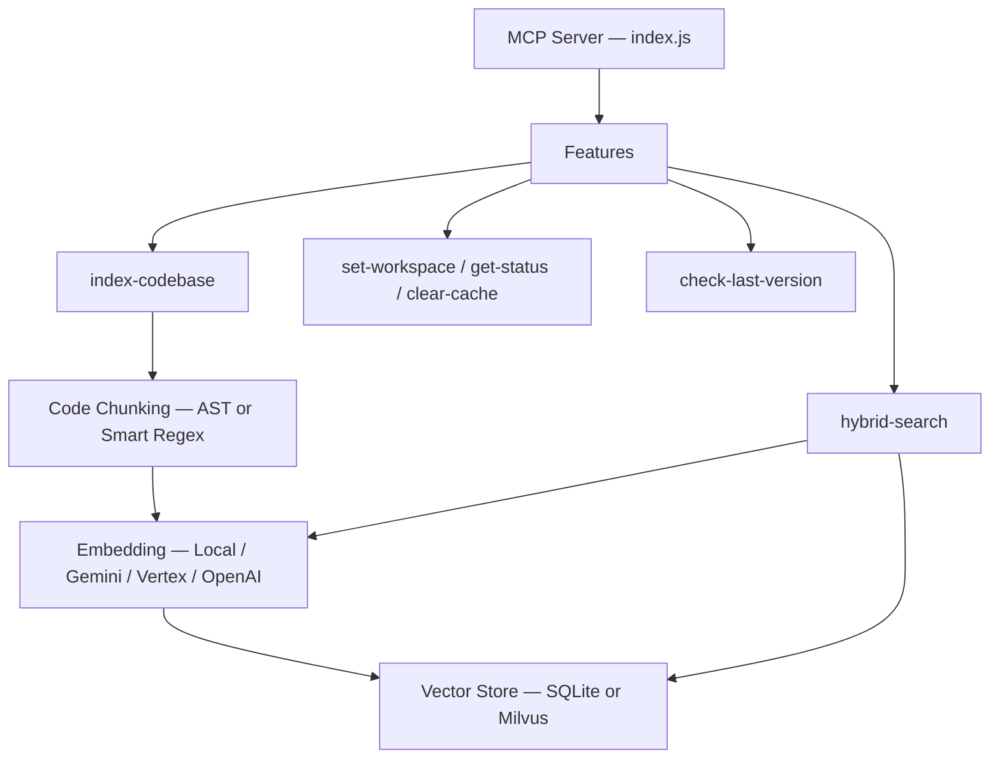
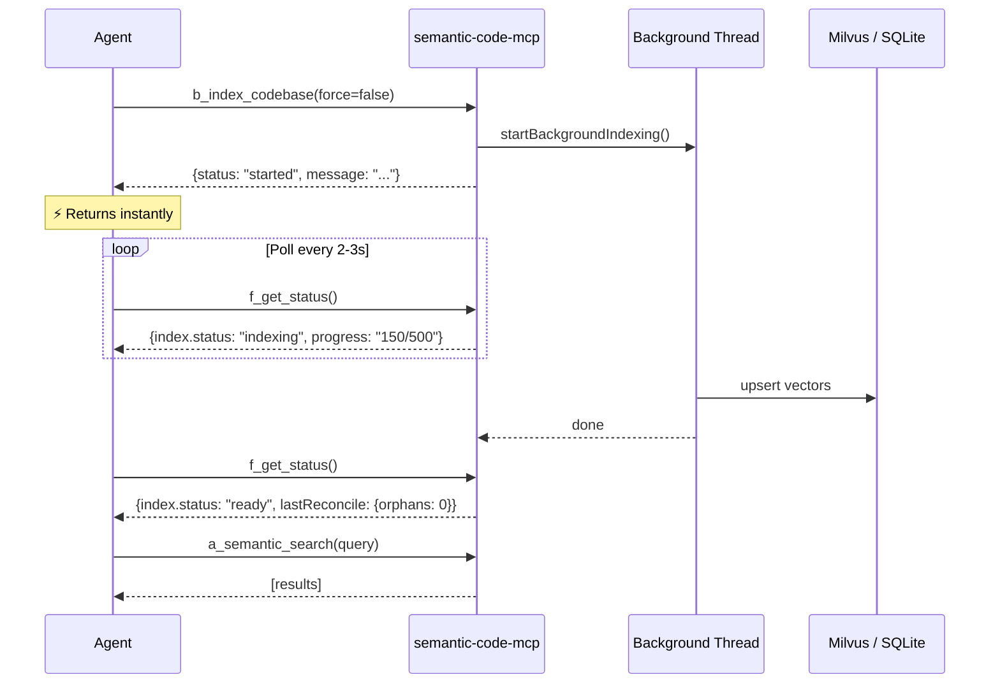

# Architecture & Internals

## System Architecture



## Non-Blocking Indexing

All indexing operations run in the **background** and return immediately.



**Progressive search** — `a_semantic_search` works during indexing with partial results.

## Node.js vs Python: Why No `to_thread`?

The sister project [markdown-fastrag-mcp](https://github.com/bitkyc08-arch/markdown-fastrag-mcp) (Python/asyncio) wraps every sync operation in `asyncio.to_thread()`. This project doesn't need that:

| Operation                     | Python asyncio                              | Node.js                                                          |
| ----------------------------- | ------------------------------------------- | ---------------------------------------------------------------- |
| File I/O (`stat`, `readFile`) | **Sync by default** — blocks event loop     | **Async by default** — `fs.promises.*` runs on libuv thread pool |
| Network I/O (Milvus gRPC)     | `milvus_client.delete()` — **sync, blocks** | Native async via Promises                                        |
| CPU-bound (embedding)         | GIL limits `to_thread` effectiveness        | `Worker threads` — true multi-core parallelism                   |

In Node.js, `await fs.stat(file)` dispatches to the libuv thread pool automatically. The event loop stays responsive.

The only CPU-bound bottleneck — **embedding computation** — is offloaded to `Worker threads` for true multi-core parallelism.

## Incremental Indexing: 2-Phase mtime→hash

Unlike markdown-fastrag-mcp's 3-way delta, this project uses a **2-phase check** handling new and modified files in one path:

```
For each file:
  1. mtime unchanged?  → skip (definitely unchanged)
  2. mtime changed → read content → compute hash
  3. hash unchanged?   → update cached mtime, skip
  4. hash changed?     → removeFileFromStore() + re-chunk + re-embed
  5. Not in cache?     → removeFileFromStore() + re-chunk + re-embed  (new file)
```

New files hit `removeFileFromStore()` (step 5), which is a **no-op** since there are no existing vectors. With SQLite, this is sub-millisecond. With Milvus, each no-op costs ~10–50ms but is acceptable for typical codebases (<5,000 files).

## Hybrid Search Scoring

```
score = ANN_similarity × semanticWeight + lexicalBoost
```

| Match type    | Boost value                          |
| ------------- | ------------------------------------ |
| Exact match   | `+exactMatchBoost` (default +1.5)    |
| Partial match | `+(matchedWords / totalWords) × 0.3` |
| No match      | +0                                   |

The server oversamples by `k × 5` from the vector store, applies lexical boosting, deduplicates per file, then returns the top-k results.

## Reconciliation Sweep

After each index run, a **reconciliation sweep** queries all file paths stored in Milvus and checks disk existence:

1. Query all `file` values (paginated, max 16,384 per query)
2. Check `fs.access()` for each path
3. Delete vectors for files that no longer exist
4. Store result in `lastReconcileResult` (exposed via `f_get_status`)

This catches ghost vectors missed by hash-based pruning (e.g., after `c_clear_cache` clears the hash file).

## Code Chunking Modes

| Mode      | Technology       | Best for                          |
| --------- | ---------------- | --------------------------------- |
| **smart** | Regex splitting  | General use, language-aware       |
| **ast**   | Tree-sitter      | Precise function/class boundaries |
| **line**  | Fixed-size lines | Simple, predictable chunks        |

**AST mode** uses Tree-sitter to parse source files and extract function/class definitions as chunk boundaries. This produces semantically meaningful chunks that align with code structure.

## Resource Throttling

CPU is capped at `SMART_CODING_MAX_CPU_PERCENT` (default 50%) during indexing. The throttle dynamically adjusts batch delays based on measured CPU usage, keeping the machine responsive for other work.

## Shell Reindex CLI

For large-scale operations, use the CLI to avoid MCP timeout limits:

```bash
cd /path/to/semantic-code-mcp
node reindex.js /path/to/workspace --force
```

| Scenario                     | Use MCP `b_index_codebase` | Use CLI `reindex.js` |
| ---------------------------- | :------------------------: | :------------------: |
| Daily incremental updates    |             ✅              |                      |
| Initial workspace setup      |                            |   ✅ (timeout-safe)   |
| Full rebuild after migration |                            |  ✅ (real-time logs)  |
| Debug 429 / gRPC errors      |                            |  ✅ (stderr visible)  |
